

  <strong>简体中文</strong> · <a href="README.en.md">English</a>

  
  <h1>SuperCV</h1>
  
<strong>优雅简洁的伴随式生产力工具</strong>

  
AI 驱动的智能剪贴板，让散落在应用之间的内容，成为随时可检索、可编辑的AI上下文。

  

    
    
    
  

  

    <strong><a href="https://github.com/ShuaiKeAng/OpenSuperCV/releases">下载最新版</a></strong>
    · <a href="docs/SuperCV_使用说明书.md">中文使用说明</a>
    · <a href="docs/SuperCV_User_Guide.md">English Guide</a>
  

  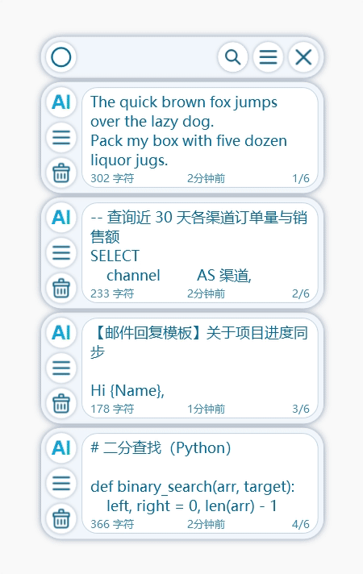
  
  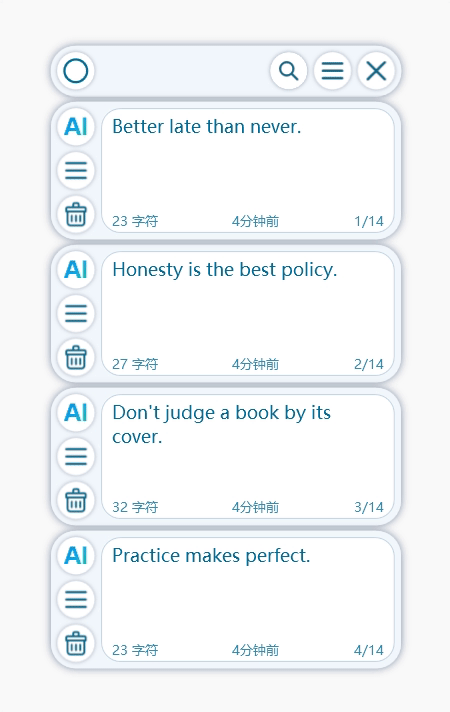

## 让剪贴板从“临时中转站”变成工作台

SuperCV 自动收集文字与图片，把分散在网页、文档、聊天和代码编辑器中的片段汇集到一个轻量桌面工作区。你可以一眼浏览最近内容，用搜索、书签、工作区快速定位，再通过单击、拖放或快捷键粘贴回正在使用的应用。

需要进一步处理时，AI 可以直接翻译、总结、润色单条内容，也可以在明确的权限范围内利用Agent 能力生成、理解、整理和编辑剪贴板内容。

  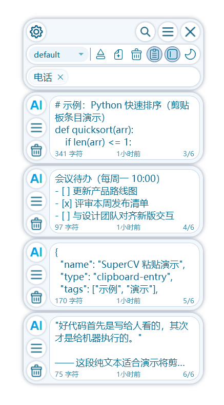

## 从复制到复用，一气呵成

1. **照常复制**：在任意应用复制文字或图片可以自动收录内容。
2. **快速定位**：滚轮滚动最近卡片，输入关键词搜索，或通过书签、颜色和工作区缩小范围。
3. **立即调用**：单击条目、拖动内容，或使用全局快捷键，把它粘贴到目标应用。
4. **按需处理**：编辑内容，或交给 AI 翻译、总结、润色和归纳等，再继续使用。

  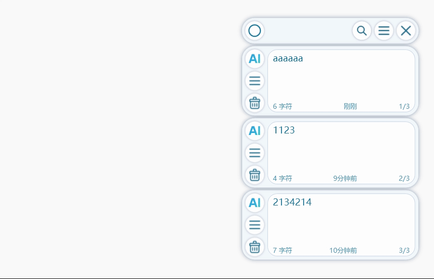
  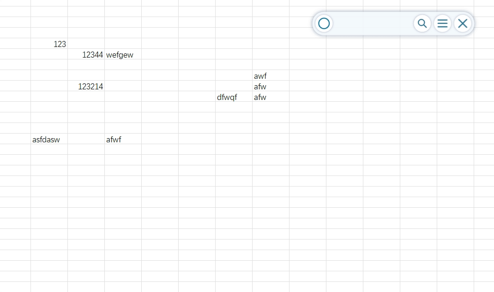

## 四个核心体验

### 找得回，也找得快

SuperCV 不只保存“最近复制”，还为不同使用频率的内容提供不同归宿。

- **工作区**：按项目、客户、课程或临时任务隔离内容，每个工作区拥有独立的普通条目与长期历史。
- **书签**：保存电话、地址、命令、固定回复等高频内容。
- **置顶**：固定当前重点到列表顶部，随时使用。
- **颜色标记**：用颜色标记类别或优先级，让重要内容始终醒目。
- **关键字检索**：在搜索框关键词搜索负责精确定位。
- **模糊搜索**：在搜索框输入 `/fs 你的描述`，可通过 AI 发现语义相关内容。
- **文字图片筛选**：在搜索框按左右方向键可以快速筛选出文字或图片。

    
  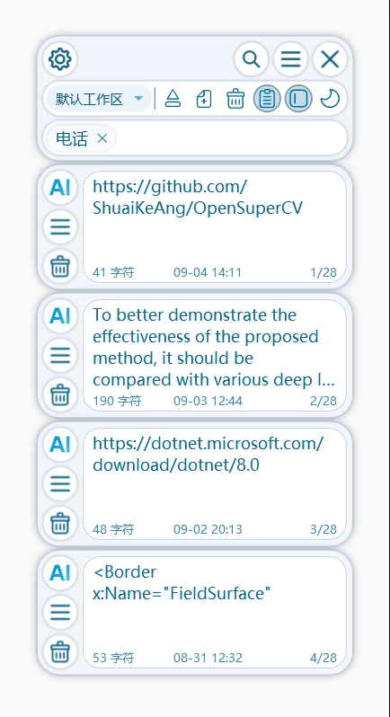
  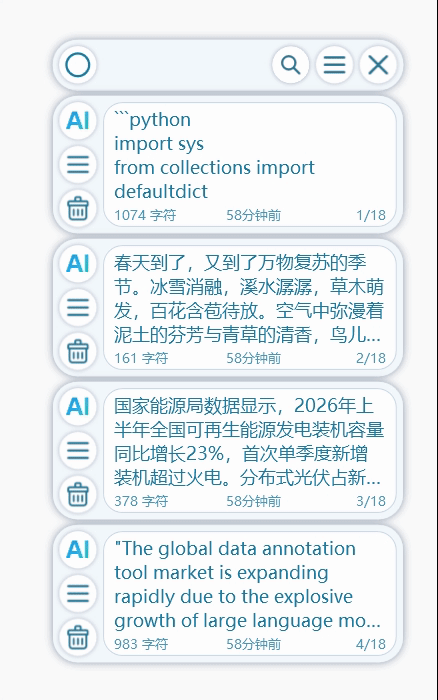
  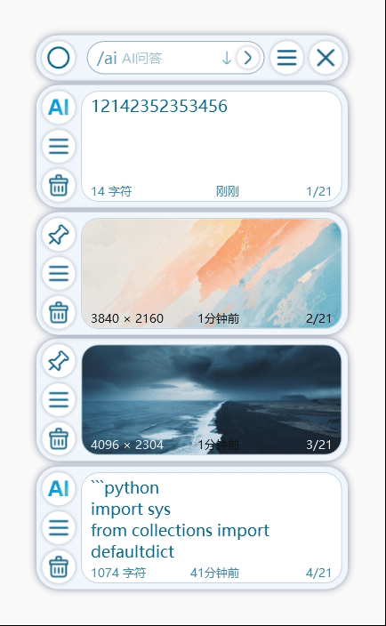

  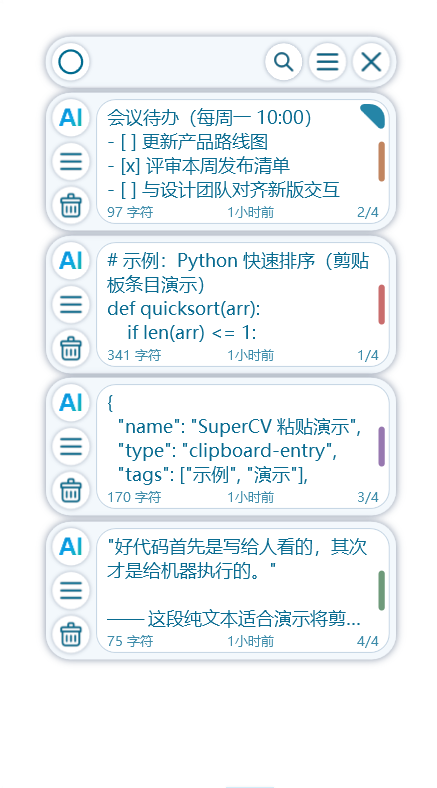
  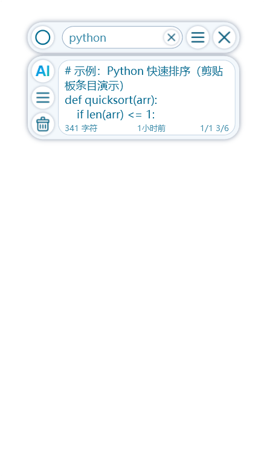

### 各种内容能顺手处理

从代码片段、富文本到参考图片，SuperCV 用统一的卡片视图承载不同内容，同时保留各自合适的操作方式。

- 收集 Unicode 文本、传统文本、HTML、RTF 与图片条目。
- 右键直接编辑文字，可以新建空白内容，记录备忘录、临时信息等，并可撤销最近修改。
- 支持查找替换，将随手复制的内容在剪贴板内直接替换字符串。
- 预览图片、查看原图，或将图片预览置顶在桌面前方。
- 自由将文字导出为 TXT／RTF，将图片导出为 PNG、JPEG、BMP 或 TIFF。

  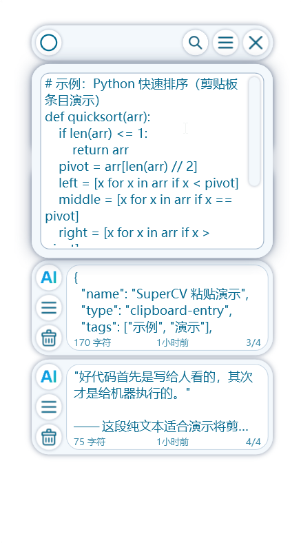
  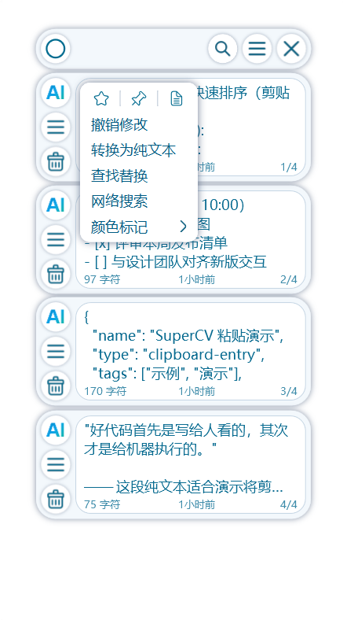
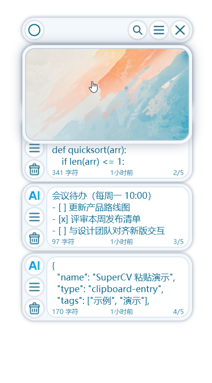

  
  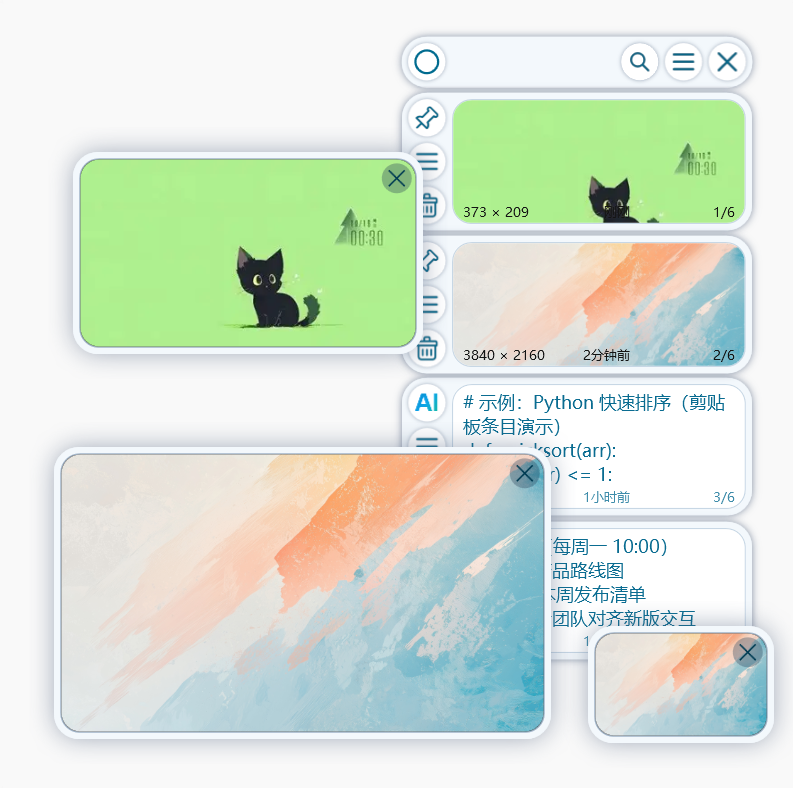
  

### AI 就在内容旁边

它最强的功能AI————可以完全关闭！

连接各大大模型厂商提供的可用的模型服务后，无需把内容搬到另一个应用，就能完成从单条加工到多条整理的工作。

**通过自定义提示词处理文本**

在文字条目上点击指令即可翻译、摘要、润色、通俗解释，或运行自定义指令，例如“改成礼貌简短的客户回复”“整理为待办清单”。

**Agent 辅助处理**

输入 `/ai 问题` 即可唤起面向当前工作区的 Agent。它会先主动调用工具查看相关条目内容，可以执行筛选、编辑、删除、新建等任务，用于归纳资料、定位信息或协助整理。

- 提供**只读、审核批准、完全访问**三档权限。
- 编辑、新建、删除、置顶或标记等操作，可在“审核批准”模式下逐次确认。
- 执行过程可以展开查看，资料读取与修改更透明。
- 可按需联网检索公开信息；本地内容的操作权限不会因此改变。

在每条内容上的AI入口回答时，Agent会主动读取该条目内容，此时Agent仍然可以访问全部条目信息。

  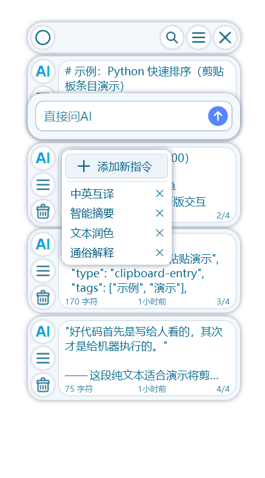
  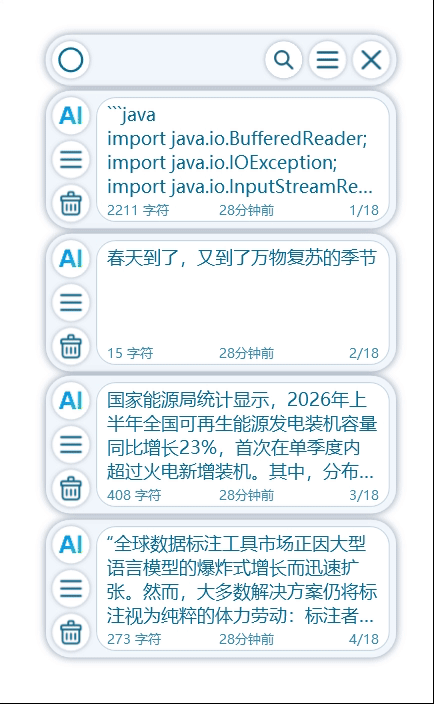

  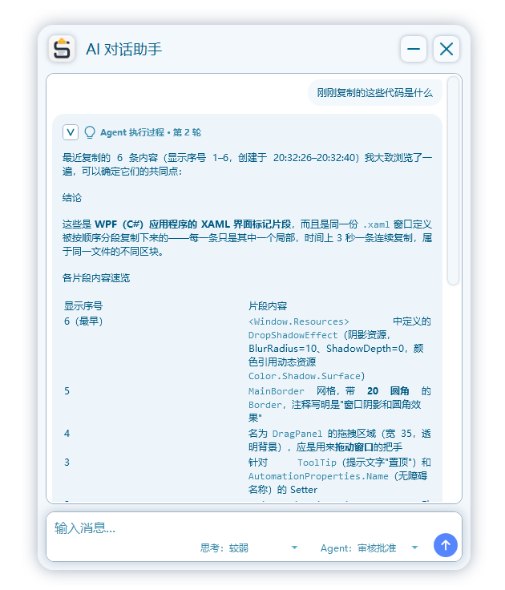
  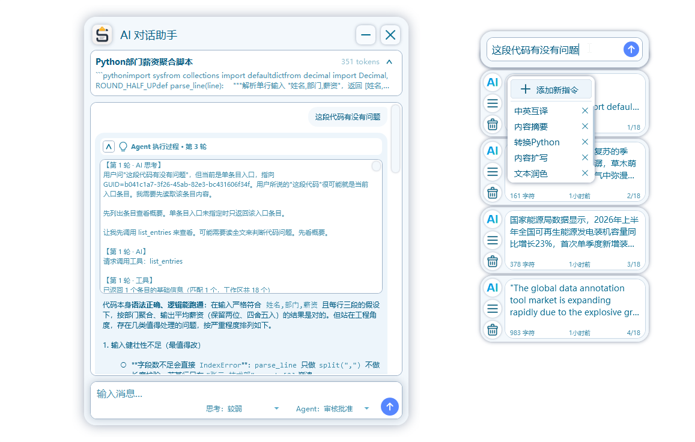

### 轻量待命，融入桌面

SuperCV 围绕“快速扫一眼，点一下就用”设计。浮动窗口保持轻巧，复杂管理只在需要时展开。

  
  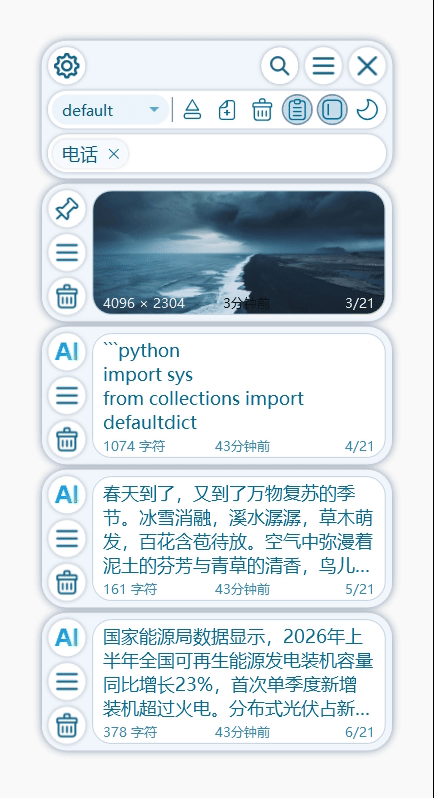

  

- **全局快捷键**：按显示序号粘贴近期条目，或连续向前／向后取用内容；快捷键可自行调整。
- **熟悉的入口**：可选择接管 `Win + V`，让新的工作流延续原有习惯。
- **后台驻留**：关闭窗口后驻留系统托盘，持续记录；也可随时暂停列表更新或直接退出。
- **个性化外观**：深色／浅色模式与多套主题可选，还可调整字号、不透明度、动画和窗口跟随速度。
- **中英文界面**：中文与 English 即时切换，首次启动提供欢迎引导。

  
  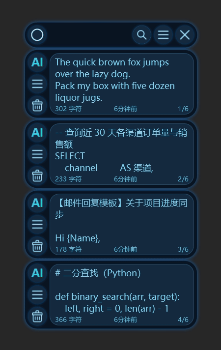

<strong>深色主题</strong>

  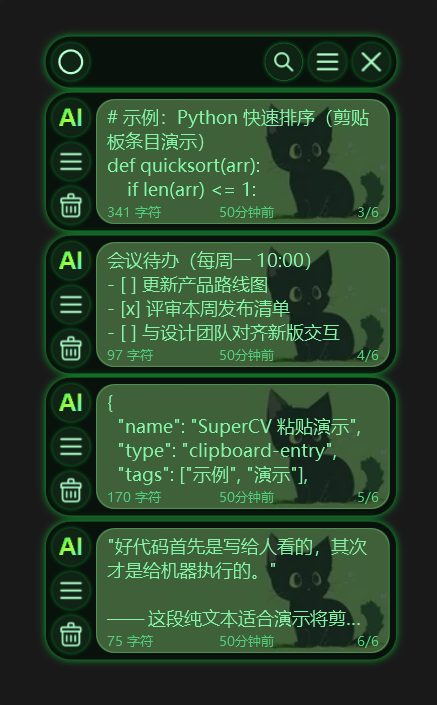
  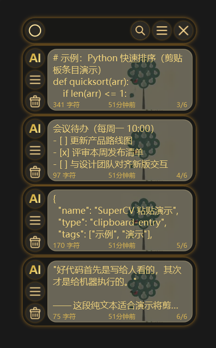
  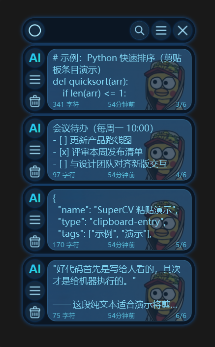
  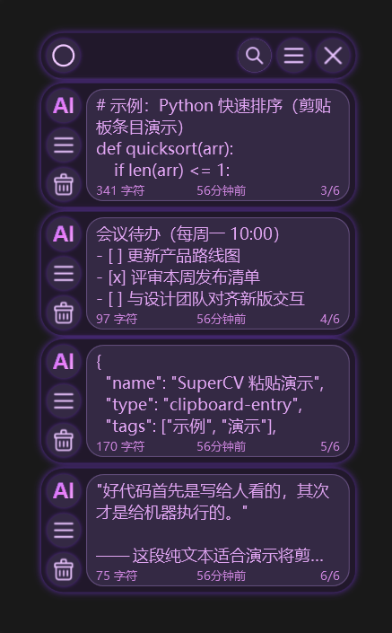
  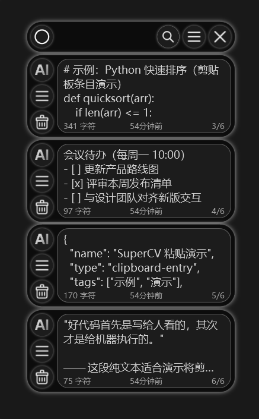

<strong>浅色主题</strong>

  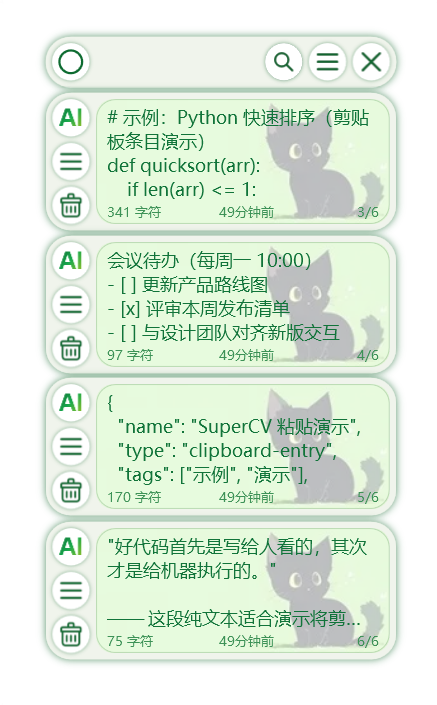
  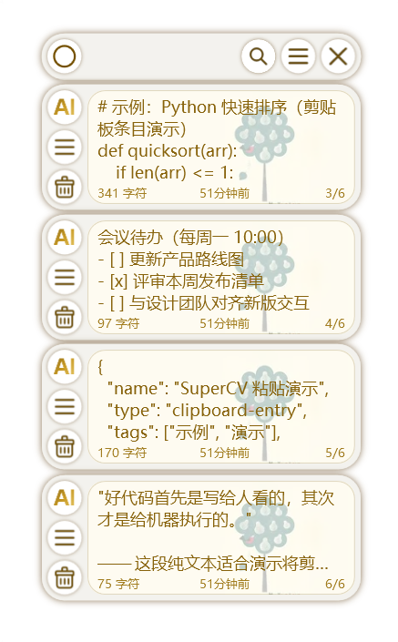
  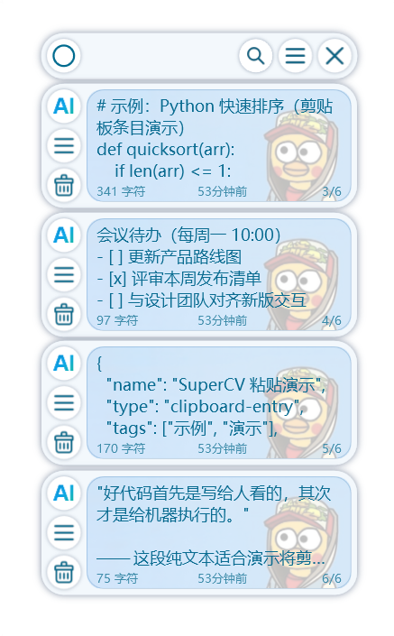
  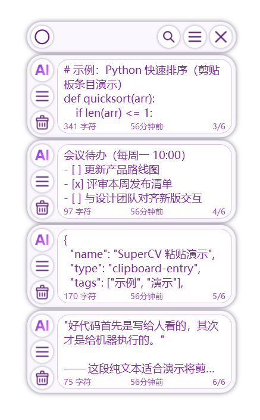
  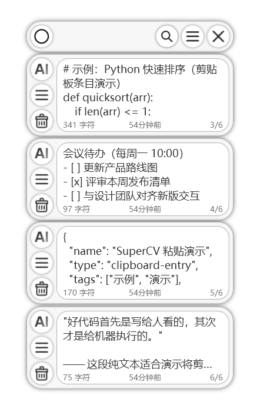

## 适合每一种高频复制场景

| 场景 | 你可以这样使用 SuperCV |
| --- | --- |
| 写作与办公 | 收集资料、保存模板、润色文案，连续粘贴多段内容 |
| 开发与运维 | 管理代码片段、命令和配置，让常用内容固定在手边 |
| 学习与阅读 | 汇集重点段落，通过搜索与 AI 快速归纳回顾 |

## 效率之外，边界同样清晰

- **AI 完全可选**：不启用 AI，也可以使用完整的剪贴板收集、整理、检索与复用能力。
- **权限由你决定**：Agent 的读取与修改范围可控，默认可使用“审核批准”模式把关写入操作。
- **数据便于迁移**：设置、工作区、历史、书签、自定义指令和图片缓存可导出为迁移文件；导入前会检查内容，并为原数据保留副本。
- **敏感内容请谨慎**：调用 AI 时，所选文字或 Agent 读取的内容会发送给你配置的模型服务。请勿向不可信服务提供密码、令牌、隐私或商业机密。

## 现在开始

SuperCV 适用于 **Windows 10 / Windows 11**。

1. 前往 [Releases](https://github.com/ShuaiKeAng/OpenSuperCV/releases) 下载并安装最新版本。
2. 启动 SuperCV，保持“列表更新”开启。
3. 在任意应用复制文字或图片，新内容会自动出现在当前工作区。
4. 单击条目或使用全局快捷键，将内容粘贴回原应用。
5. 如需 AI，在“设置 → AI”中启用模型服务并完成连接测试。

> 第一次使用？查看完整的 [中文使用说明书](docs/SuperCV_使用说明书.md) 或 [English User Guide](docs/SuperCV_User_Guide.md)。

## 反馈与参与

如果你有功能建议、使用问题或发现异常，欢迎前往 [Issues](https://github.com/ShuaiKeAng/OpenSuperCV/issues) 交流。提交问题时，请尽量附上使用场景、复现步骤和预期行为。

## 赞助项目

如果 SuperCV 对你有帮助，欢迎通过 [支付宝赞助](https://qr.alipay.com/fkx19443x3resifs2w0ns50?0&T=58659-12-11%2005:52:47)。

  

本项目采用仓库中的 [LICENSE](LICENSE.txt) 许可。
